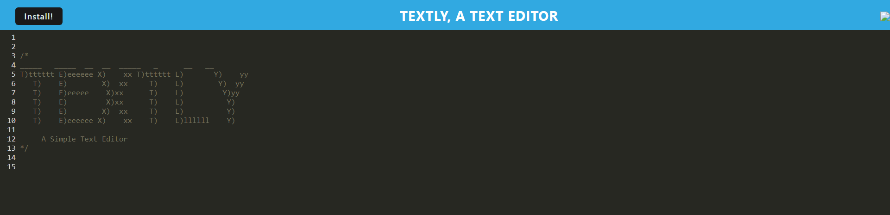

# Textly, a PWA online text editor
  []
  ## Description
  This project is designed to demonstrate the development of a full-stack PWA for text editing using an indexedDB database. 

  ## Link To The Live Page

  https://textly-bzmf.onrender.com/

  ## Image Of The Final Product
  
    
   ## User Story
  AS A developer
I WANT to create notes or code snippets with or without an internet connection
SO THAT I can reliably retrieve them for later use

  ## Acceptance Criteria
  GIVEN a text editor web application
WHEN I open my application in my editor
THEN I should see a client server folder structure
WHEN I run `npm run start` from the root directory
THEN I find that my application should start up the backend and serve the client
WHEN I run the text editor application from my terminal
THEN I find that my JavaScript files have been bundled using webpack
WHEN I run my webpack plugins
THEN I find that I have a generated HTML file, service worker, and a manifest file
WHEN I use next-gen JavaScript in my application
THEN I find that the text editor still functions in the browser without errors
WHEN I open the text editor
THEN I find that IndexedDB has immediately created a database storage
WHEN I enter content and subsequently click off of the DOM window
THEN I find that the content in the text editor has been saved with IndexedDB
WHEN I reopen the text editor after closing it
THEN I find that the content in the text editor has been retrieved from our IndexedDB
WHEN I click on the Install button
THEN I download my web application as an icon on my desktop
WHEN I load my web application
THEN I should have a registered service worker using workbox
WHEN I register a service worker
THEN I should have my static assets pre cached upon loading along with subsequent pages and static assets
WHEN I deploy to Render
THEN I should have proper build scripts for a webpack application
  ## Usage
 Once the user has navigated to the deployed web application, they simply enter the text of their choosing. Pressing "enter" will start a new line in the editor. If the user clicks a new tab, or clicks the search bar, or any other part of the screen off of the app, the application will "lose focus" which will trigger a save event to occur. When the user exits out of the application and then returns to the application later, the text that was previously entered will be saved in the textly database. The app is also able to be installed locally by clicking the "install" button in the upper left corner of the screen. When installed, the application will create an icon on the desktop which allows the user to use the application locally, and their entered data will persist from the online version into the local copy. 

  ## Contributing
  This project was created by Luke Stroehlein with base code from BCS for help. The tutor Charles Puente-Matos helped reduce errors and increase functionality in the application. The tutor Benicio Lopez helped complete debugging errors and helped get the application deployed on Render. Classmate Nathaniel Davis inspected the database.js file during development of the app and made multiple suggestions of how to improve functionality. Much help was found on the internet including resources such as w3schools and stack overflow.
  ## License
  This project is licensed under the MIT license.
  ## Tests
  The best way to test this project is to open up Chrome dev tools and head to the console. In the console the data handling can be viewed including a confirmation of data being saved. The database can be inspected using the "application" section of the inspection tool as well as the service worker functions" Please enjoy my application and thank you for having a look! 🤓💻🤖

  ## Questions
  If you have any questions, please feel free to reach out to me at strolinedigital@gmail.com. 
  You can also view my GitHub profile at https://github.com/StrolineDigital

